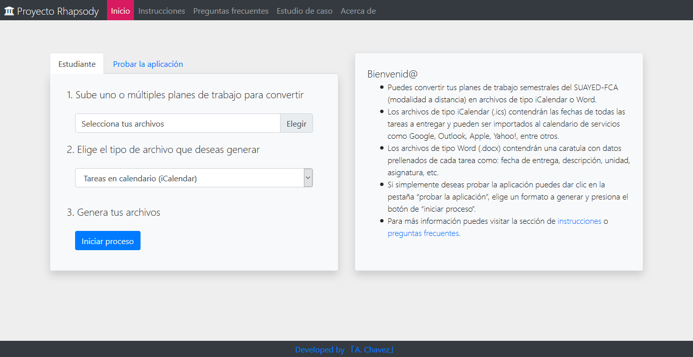

# Proyecto Rhapsody – aplicación web
## Descripción
#### Introducción
Esta aplicación web está dirigida a estudiantes del sistema de educación a distancia de la UNAM, se encarga de tomar un plan de trabajo semestral para extraer las fechas e información de todas las tareas a entregar durante el semestre y genera un archivo con formato iCalendar que puede ser importado en calendarios de servicios como Google, Apple, Outlook, Yahoo!, etc. Otra funcionalidad de esta aplicación es utilizar la información extraída del plan de trabajo semestral y generar archivos de Word para cada tarea que contendrán una caratula con datos prellenados y específicos a cada tarea a entregar durante el semestre.
#### ¿Qué es y para que me sirve un archivo iCalendar?
iCalendar es un formato de archivo, no confundir con alguna aplicación asociada a la compañía Apple. Un archivo de tipo iCalendar permite a los usuarios almacenar y compartir entre dispositivos y servicios calendarios con eventos en fechas específicas, es decir, en esta aplicación el archivo iCalendar contendrá una lista de eventos en el calendario donde cada uno de ellos serán las tareas por entregar durante todo el semestre para una asignatura específica, cada tarea tendrá asociada la fecha de entrega, la descripción, el nombre de la materia, entre otros datos.

Por cada uno de los planes de trabajo subidos esta aplicación generará un archivo iCalendar, es decir, se creará un calendario por asignatura, de esta manera dichos archivos pueden ser importados en los calendarios de servicios como Google, Outlook, Apple, Yahoo!, etc. 
#### ¿Qué es y para que me sirve el archivo Word?
El archivo de tipo Word será simplemente un documento que contendrá una caratula, normalmente las tareas que como estudiantes del SUAYED debemos entregar suelen ser en su mayoría archivos de texto realizados en Word, como parte de una buena presentación dichos documentos deben ir acompañados de una caratula (a no ser que se especifique lo contrario), así entonces esta aplicación generará un archivo para todas y cada una de las tareas a entregar en el semestre, y cada archivo contendrá una caratula con datos prellenados como el nombre de la licenciatura, nombre de la materia, tipo de actividad, fecha de entrega, entre otros datos. Cabe destacar que cada archivo generado en este formato será específico para cada tarea de cada asignatura. 
## Tecnologías utilizadas:
* Spring Boot
* Java
* Thymeleaf
* HTML
* CSS
* JavaScript
* Bootstrap
* jQuery
## Captura de pantalla
